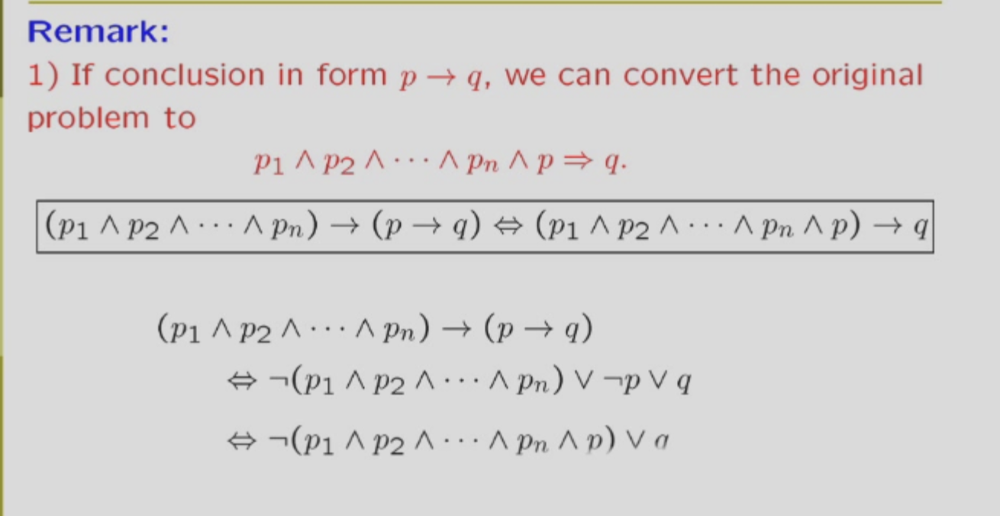

# 命题逻辑选谈

ps:知识点普及

1. 重延式：永远对的
2. 矛盾式：永远错的
3. 重要转换公式1：p->q 等于 非p析取q
4. 重要转换公式2：p<->q 等于 （p->q）析取（q->p） 意思就是两个命题是等价的
5.命题是有真假的陈述句

## 命题逻辑之normal forms

这里的东西和数字逻辑里面讲的几乎一样，只是换了个词语，这里不多赘述。

只需要注意一个点，由于离散数学有->符号，处理他要用重要转换公式1哦，同时记得用德摩根把**非**送进括号里面

---

### 命题逻辑之推理

推理其实就是几个命题（前提）能不能推出另一个命题*结论）

用符号表示其实就是 p1合取p2合取p3合取p4->p5是不是永远真的，即所有前提都对时，结论一定真，有一个假的，结论随便，此时推理成立。

ps:**有7个比较基础的推理形式，在ppt给出**

这里有个小技巧，即结论如果是个条件式（p->q）
那么可以把p也放在前提。
这里式具体证明
  
还有个小技巧：反证法,具体操作就是结论取反引入，之后证明会推出矛盾式  
这里是具体证明

### 命题逻辑之谓词，量词

根据所有人都要死->苏格拉底要死，我们发现原来的演算系统不够用，因此我们引入谓词，量词。

- 谓词：描述事物关系，个体特性的，比如x>3 谓词本身不是命题，没有真假。但是可以通过带入或者添加量词变成命题。
- 量词：就是存在，所有这种
